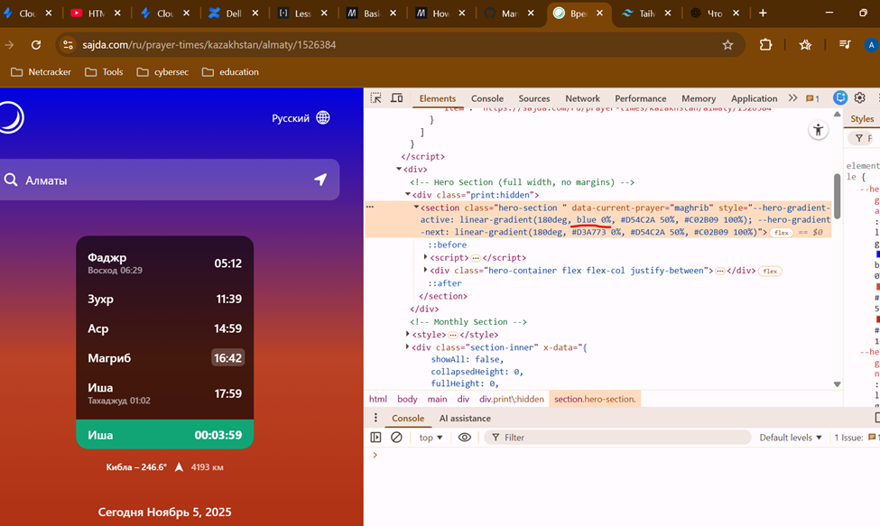
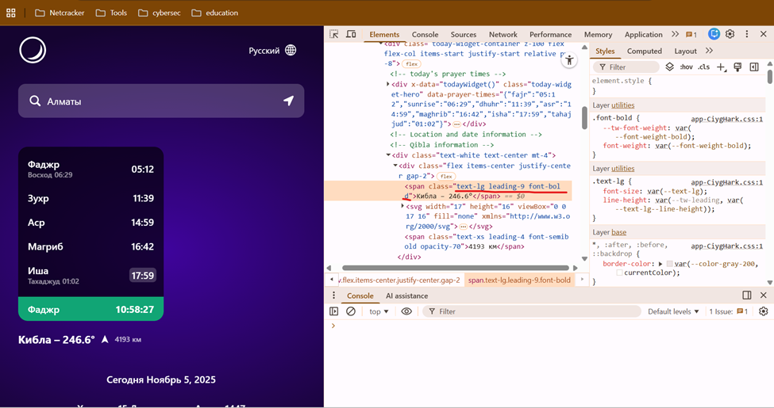
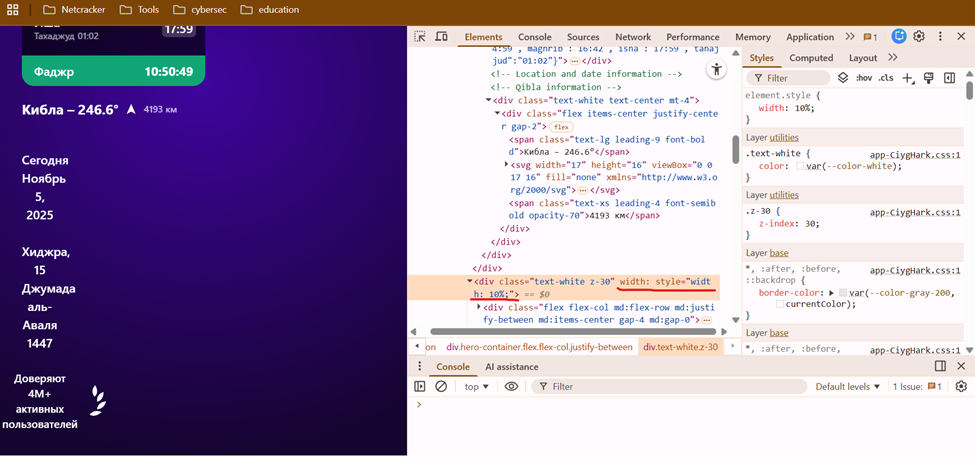

**Содержание**
В данной задаче было проведено исследование 3-х сайтов:
1. https://sajda.com/ - мировой ресурс разработанный ребятами из Казахстана, в частности из Алматы. Изначально имел некоммерческую цель, а на уровне альтруизма. 
Позже стал использоваться большим комьюнити практикующих мусульман для определения времени молитвы в разных странах. Крайне ценно использовать при путешествиях. Пару лет назад подверглись взлому.
Изменила следующие алиасы:
- цвет
- контраст
- расположение таблицы
- шрифт
- размер шрифта
- расстояние между двумя объектами
- ширину текста

В своем коде используют комментарии; 
Применение Tailwind; 
Работа с геолокацией и математичсекий расчет азимута; 
Наличие CSRF токена. 

2. https://howard-chai.medium.com/lets-watch-her-2013-7f06456b475c
Nothing special, just an interesting story from a movie, where a lonely man sits on Tinder and feels nothing for anyone. But then he falls in love with an AI operating system that understands him fully. 
Интересный факт, что эта статья опубликована на популярном ИТ-портале и пока ты думала, что поресерчишь их, они хотят поресерчить тебя: 
"We're hiring! https://medium.com/jobs-at-medium/work-at-medium-959d1a85284e"

Используют meta тэги; 
Link тэги для подключения CSS; 
Script тэги - проверка на каптчy. 

3. https://www.nasa.gov/humans-in-space/
Очень сложный для восприятия сайт, много непонятного и кастомизированного в скриптах.
